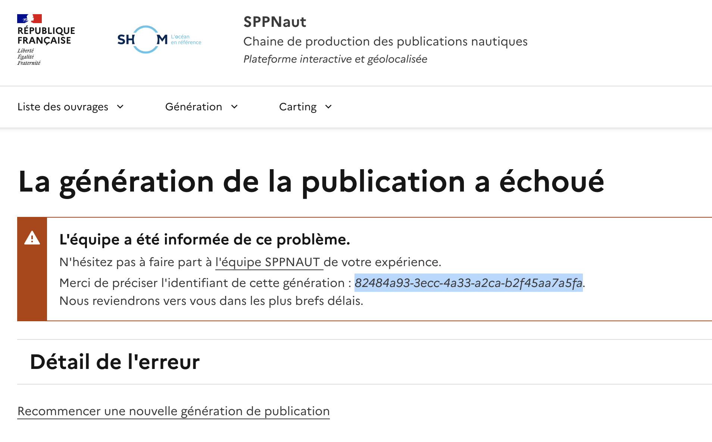
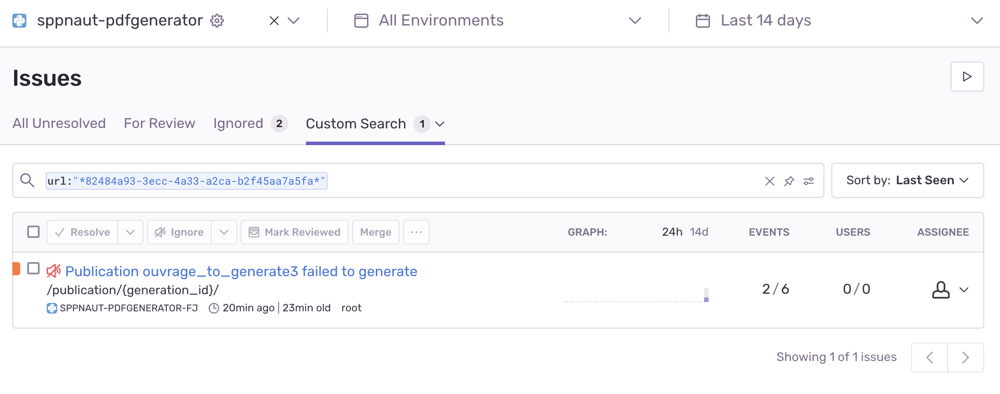

## Investigation de bug lors de la génération d'ouvrage sur SPPNaut

Quand l'application affiche une erreur de génératition à l'utilisateur, le message suivant est affiché :

Il est recommandé d'écrire à l'équipe avec l'identifiant de génération permettant de retrouver l'erreur sur Sentry.

Pour trouver l'erreur sur Sentry, il suffit de rechercher l'id dans l'url comme suit:

`url:"*82484a93-3ecc-4a33-a2ca-b2f45aa7a5fa*"`

